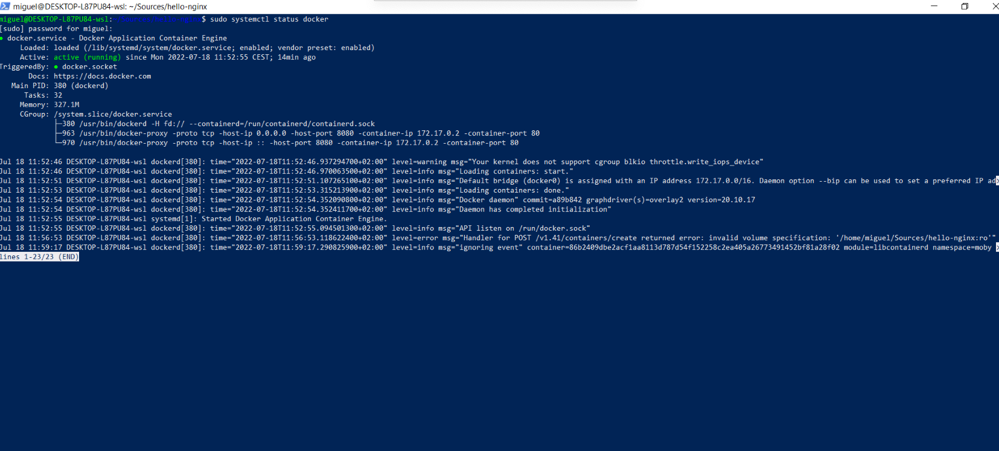
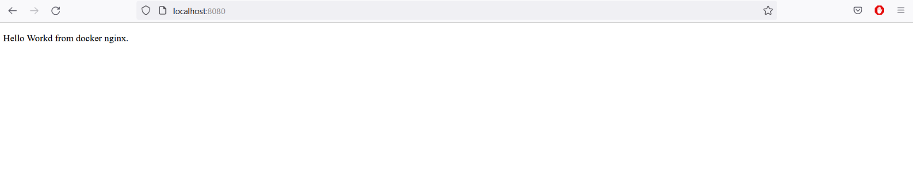

# Description
Documentation install Docker under Windows 10

## Dependencies

- Windows 10 Home or later

## Install Kernel WSL Application (Ubuntu 20.04)
```
wsl --install -d Ubuntu
```

## Set Ubuntu App default app if not
```
wsl -s Ubuntu
```

## install some dependencies
```
sudo apt-get update
sudo apt-get install wget
sudo apt-get install curl
```

## Add genie repository
```
sudo su
wget -O /etc/apt/trusted.gpg.d/wsl-transdebian.gpg https://arkane-systems.github.io/wsl-transdebian/apt/wsl-transdebian.gpg

chmod a+r /etc/apt/trusted.gpg.d/wsl-transdebian.gpg

cat << EOF > /etc/apt/sources.list.d/wsl-transdebian.list
deb https://arkane-systems.github.io/wsl-transdebian/apt/ $(lsb_release -cs) main
deb-src https://arkane-systems.github.io/wsl-transdebian/apt/ $(lsb_release -cs) main
EOF

apt update

exit
```

## Install systemd genie
```
sudo apt install -y systemd-genie
```

## Remove systemd errors

Check mount device
```
mount
```

Remove **systemd-remount-fs.service** error check device and execute the next command with the device checked previusly
```
sudo e2label /dev/sdb cloudimg-rootfs
```

Remove **ssh.service** error
```
sudo ssh-keygen -A
```

Remove **multipathd.service** error
```
sudo systemctl disable multipathd.service
```

## Install Docker CE

```
sudo apt update

sudo apt install apt-transport-https ca-certificates curl software-properties-common

curl -fsSL https://download.docker.com/linux/ubuntu/gpg | sudo gpg --dearmor -o /usr/share/keyrings/docker-archive-keyring.gpg

echo "deb [arch=$(dpkg --print-architecture) signed-by=/usr/share/keyrings/docker-archive-keyring.gpg] https://download.docker.com/linux/ubuntu $(lsb_release -cs) stable" | sudo tee /etc/apt/sources.list.d/docker.list > /dev/null

sudo apt update

apt-cache policy docker-ce

sudo apt install docker-ce

sudo systemctl status docker
```



## Configure docker without user

```
sudo usermod -aG docker ${USER}
```

## Test docker

```
docker run --name hello-nginx -d -p 8080:80 -v /home/miguel/Sources/hello-nginx:/usr/share/nginx/html:ro nginx
```



## Install docker-compose

```
sudo curl -L "https://github.com/docker/compose/releases/download/1.26.0/docker-compose-$(uname -s)-$(uname -m)" -o /usr/local/bin/docker-compose

sudo chmod +x /usr/local/bin/docker-compose

docker-compose --version
```

## Start WSL

```
wsl genie -s
```

## Stop WSL

```
wsl --shutdown
```

## Install Docker CE without genie

Add this script to your .bashrc file of your distribution
```
DOCKER_DISTRO="Ubuntu"
DOCKER_LOG_DIR=$HOME/docker_logs
mkdir -pm o=,ug=rwx "$DOCKER_LOG_DIR"
/mnt/c/Windows/System32/wsl.exe -d $DOCKER_DISTRO sh -c "nohup sudo -b dockerd < /dev/null > $DOCKER_LOG_DIR/dockerd.log 2>&1"
```

## Install Docker CE from tarball

Download Ubuntu tarball like this
```
curl https://cloud-images.ubuntu.com/releases/focal/release/ubuntu-20.04-server-cloudimg-amd64-wsl.rootfs.tar.gz
```

Then execute this command to create a distribution for this tarball
```
wsl --import <Distribution Name> <Installation Folder> <Ubuntu WSL2 Image Tarball path>
wsl --import Ubuntu-20.04 "C:\Users\masal\Documents\ubuntu2" .\ubuntu-20.04-server-cloudimg-amd64-wsl.rootfs.tar.gz
```

Now execute this distribution
```
wsl -d Ubuntu-20.04
```

Now install docker and docker-compose explained above

Finally to start dockerd when the distribution start, update the **.bashrc** file for the **root** user under **/root** folder. and add this line:
```
service start docker
```

We can stop and start again our new Ubuntu distribution to access to docker
```
wsl --shutdown
wsl -d Ubuntu-20.04
```

## Some links
- WSL Genie: https://github.com/arkane-systems/genie
- WSL Genie systemd errors:https://github.com/arkane-systems/genie/wiki/Systemd-units-known-to-be-problematic-under-WSL
- Install docker-ce in Ubuntu 20.04: https://www.digitalocean.com/community/tutorials/how-to-install-and-use-docker-on-ubuntu-20-04-es
- Install docker-compose in Ubuntu 20.04: https://github.com/masalinas/doc-docker-windows
- Install docker in WSL Windows: https://dev.to/bowmanjd/install-docker-on-windows-wsl-without-docker-desktop-34m9
